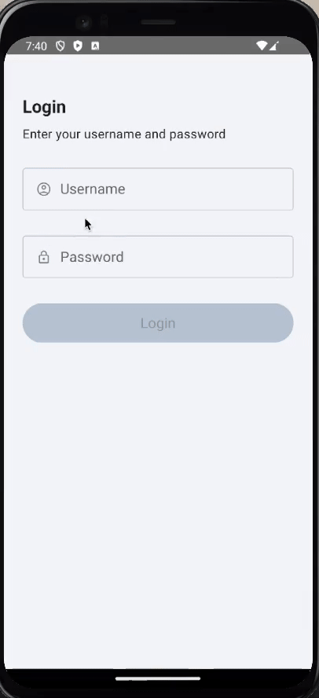
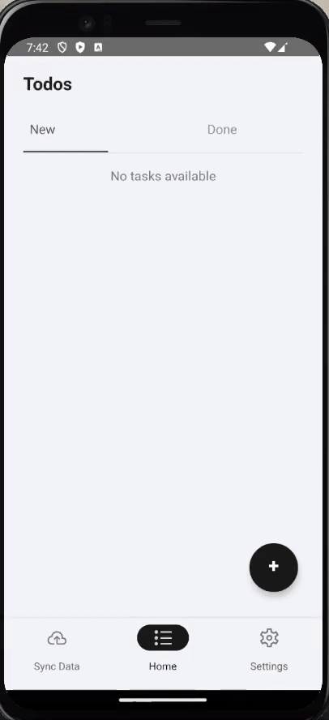
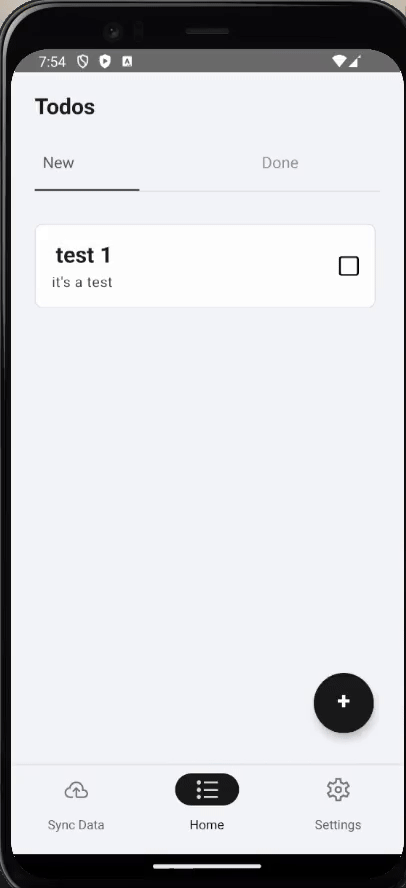
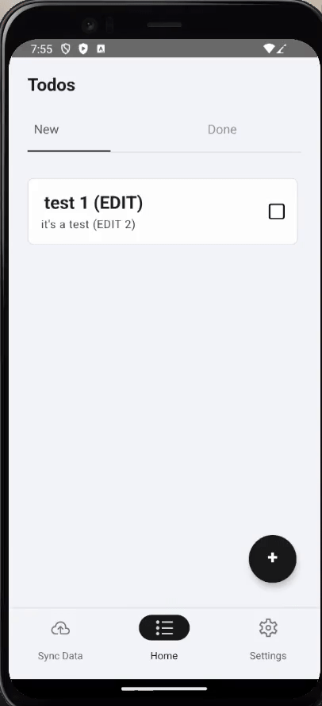
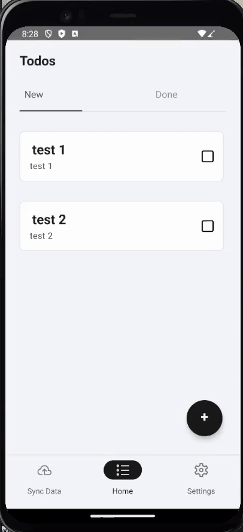
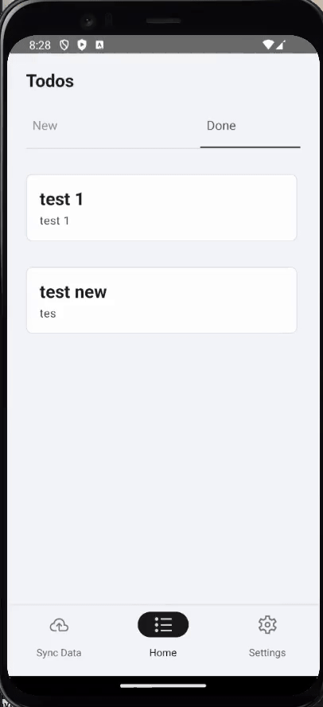
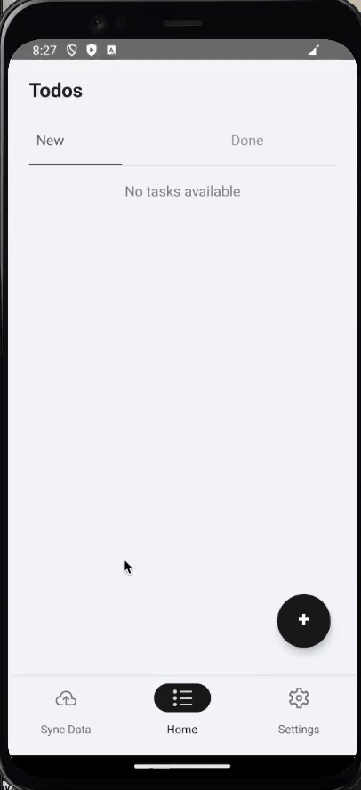

# **My Todo App**
A React Native project to manage todos with offline-first functionality, error handling, and synchronization when online.

---

## **Table of Contents**
1. [Features](#features)
2. [Requirements](#requirements)
3. [Setup Instructions](#setup-instructions)
4. [Running the Project](#running-the-project)
5. [API Information](#api-information)
6. [Features in Action](#features-in-action)
7. [Future Improvements](#future-improvements)
8. [Technologies Used](#technologies-used)

---

## **Features**
- Login with error handling
- Create, edit, delete, and mark todos as done
- Logout functionality
- Offline-first architecture with error synchronization when online

---

## **Requirements**
- **Node.js**: Version 20+
- **NPM**: Version 6+ or **Yarn**: Version 1.22+
- **React Native CLI**
- **Android Studio** or **Xcode** (for Android and iOS development)

---

## **Setup Instructions**
1. Clone the repository:
   ```bash
   git clone https://github.com/odailsonsilva/todolist-storage
   cd todolist-storage
   ```

2. Install dependencies:
   ```bash
   npm install
   ```

3. Run the project:

   **For Android:**
   ```bash
   npx react-native run-android
   ```

   **For iOS:**
   ```bash
   npx pod-install
   npx react-native run-ios
   ```

4. Start the Metro bundler:
   ```bash
   npm start
   ```

---

## **Running the Project**

### For Android
1. Ensure you have Android Studio installed.
2. Open the Android Virtual Device (AVD) Manager and start an emulator.
3. Run:
   ```bash
   npx react-native run-android
   ```

### For iOS
1. Ensure you have Xcode installed.
2. Install pods:
   ```bash
   npx pod-install
   ```
3. Run:
   ```bash
   npx react-native run-ios
   ```

---

## **API Information**
This project uses a MockAPI online service with the following base URL:
```
https://67479afd38c8741641d72cdf.mockapi.io/api
```

### Endpoints
- **Todos Endpoint:**
  ```
  https://67479afd38c8741641d72cdf.mockapi.io/api/todos
  ```

- **Users Endpoint:**
  ```
  https://67479afd38c8741641d72cdf.mockapi.io/api/users
  ```

### Test Users for Login
- **User 1:**
  - Login: kitch@teste.com
  - Password: teste123

- **User 2:**
  - Login: kitch2@teste.com
  - Password: teste123

---

## **Features in Action**

1. **Login and Error Handling**
   - Users can log in, and appropriate error messages are displayed for invalid inputs.

    


2. **Create a Todo**
   - Allows users to create a new todo.

    

3. **Edit a Todo**
   - Edit the title or mark a todo as incomplete.

    

4. **Delete a Todo**
   - Delete an existing todo from the list.

    

5. **Mark as Done**
   - Mark a todo as completed.

     

6. **Logout**
   - Log out of the app.

    

7. **Offline Functionality**
   - Users can manage todos while offline. When the internet reconnects, the app synchronizes data and shows an action sheet.

     

---

## **Future Improvements**
- Add unit and integration tests using Jest and Testing Library.
- Enhance todos with additional fields:
  - **Date Picker**: Allow users to select a due date.
  - **Category Selector**: Provide categories for better organization.
  - **Priority Levels**: Add prioritization to todos.
- Implement filters for todos, such as completed, pending, or by category.

---

## **Technologies Used**
- React Native
- @react-native-async-storage/async-storage
- Axios
- RealmDB
- React Navigation
- React Native Action Sheet

